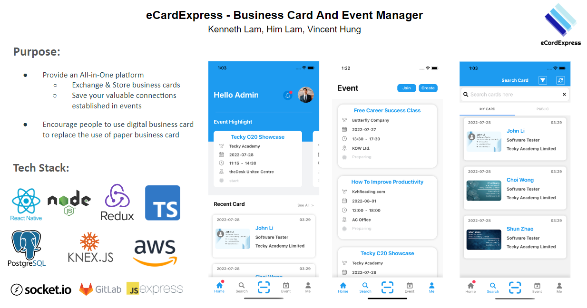

# eCardExpress


<br/>
Business Card and Event Manager. 
<br/>
A mobile application for trade, store, design business cards and hold events. 
<br/>
The event function allows participants to post their business card to enhance business network and opportunity. 
<br/>
It supports iOS and Android platforms.

- [Screenshots](#screenshots)
- [Init](#init)
- [Devices](#devices)
- [Physic Build](#physicBuild)
<br/>
<br/>

<br/>

# Screenshots


<br/>
More details:
https://docs.google.com/presentation/d/14DY2FlHw4qUuLLrGZMQCVq6lbukBCPzW9EMCEvHHH78/edit?usp=sharing
<br/>

# Init
Frontend:
 - ios: pod install / arch -x86_64 pod install
 - To build & start app in emulator/ remote console
```shell
yarn android / yarn ios
```
Backend:
 - Setup env file by using env-example
 - To start up server in port 8080
```shell
yarn start
```

# Devices:
ios / android 11 or above

# Physic Build (Android):
- Need to remove app from the device first if any config (e.g. .env) changed
- Open the frontend android folder and build in <b>Android Studio</b>
- npx react-native run-android --reset-cache

# !!! Need to run the below script after each yarn install

Run auto script replacer
```shell
bash dependencyfix.sh
```
Known errors if not run: 
- Invariant Violation: ViewPropTypes has been removed from React Native..... 
- Execution failed for task ':react-native-mlkit-ocr:compileDebugKotlin'.

# Cache and node_modules clean up:
```shell
bash clean.sh
```
